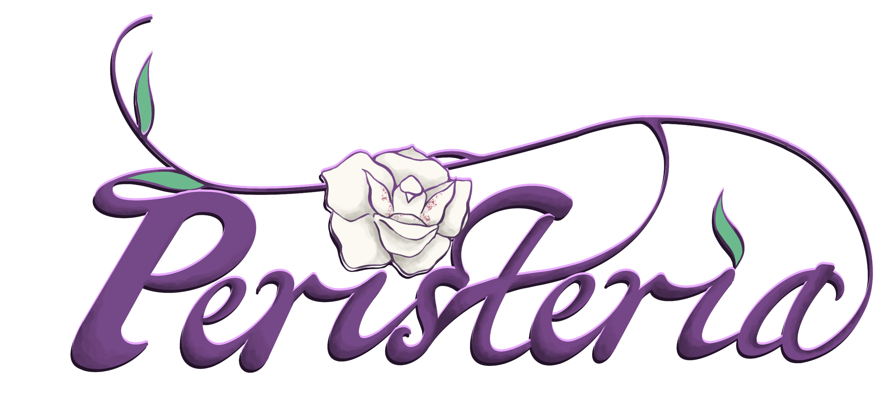

# Assignment 5

This is a step up, and step down from the last few assignments. This is
implemented using Three.js, so the code I'm writing is a lot less impressive. At
the same time, what you actually get to look at is far, far more impressive.

## Sources

The water shader is a ported version of
[BinBun's Godot Water Shader](https://binbun3d.itch.io/godot-water-shader),
licensed under CC0.

Peristeria Logo by my good friend Kimberly Jeung, production lead on the
Peristeria project.

## Gen AI Acknowledgment

All uses of Gen AI was using Claude Sonnet 4.6.

I used Gen AI in the process of translating BinBun's water shader from Godot to
Three.js. I also used it to help debug the process of porting my painterly
shader from Godot.

Gen AI was also used to make a nicer HTML interface. I wanted to have a
scrolling overlay sort UI, so I sketched a concept w/ HTML and asked it to write
CSS for it.
